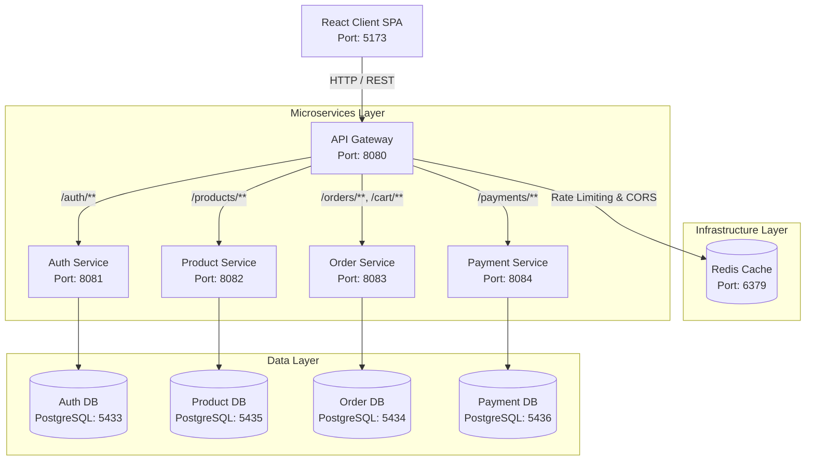

# 🛒 Nexus Cart - Microservices E-Commerce Platform

A fully containerized microservices-based e-commerce platform built with **Spring Boot**, **Spring Cloud Gateway**, **React (Vite)**, **PostgreSQL**, and **Redis**.

NexusCart demonstrates a Service-Oriented Architecture (SOA) and Enterprise Microservices Patterns, featuring centralized routing, rate limiting, independent domain databases, interactive OpenAPI documentation, and end-to-end security filtering.

---

## 📐 Architecture Overview



All services communicate over a shared, isolated Docker bridge network (`nexus-network`).

---

## 🚀 Services & Ports

| Service | Port | Description | Database Port |
|---|---|---|---|
| **api-gateway** | `8080` | Centralized Gateway (Routing, CORS, Rate Limiting, Swagger Aggregation) | — |
| **auth-service** | `8081` | User registration, authentication & OAuth 2.0 / JWT issuance | `5433` |
| **product-service** | `8082` | Product catalog CRUD & inventory management | `5435` |
| **order-service** | `8083` | Persistent shopping cart & order processing | `5434` |
| **payment-service** | `8084` | Payment processing pipeline | `5436` |
| **frontend** | `5173` | React SPA (Vite dev server / Nginx production container) | — |
| **redis-cache** | `6379` | Token-bucket rate limiter storage | — |

---

## 🛠️ Tech Stack

### Backend & Infrastructure
- **Java 21** with **Spring Boot 3.x**
- **Spring Cloud Gateway** – Netty-based reactive edge routing & global CORS filtering
- **Redis** – Distributed request rate limiting (`RequestRateLimiter` filter)
- **Spring Security** – OAuth 2.0 & JWT authentication filtering
- **Spring Data JPA** with **Hibernate**
- **PostgreSQL 16** – Database-per-service pattern
- **OpenAPI 3.0 / Swagger UI (`springdoc-openapi`)** – Interactive API documentation
- **Lombok** – Boilerplate reduction
- **JJWT 0.11.5** – JWT generation and parsing
- **Gradle** – Multi-project build automation
- **Docker & Docker Compose** – Containerization & multi-container orchestration

### Frontend
- **React 18 / 19** with **Vite**
- **React Router DOM** – Single Page Application (SPA) client-side routing
- **Axios** – Centralized HTTP client with request/response interceptors for API Key & Bearer Token injection
- **Tailwind CSS** – Utility-first UI styling
- **Lucide React** – Component icons

---

## 👥 Team Individual Contributions

| Team Member | Role | Assigned Components | Key Deliverables & Technical Contribution |
| :--- | :--- | :--- | :--- |
| **ITBNM-2313-0061** | Team Lead / Backend Architect | API Gateway, Auth Service & Security Infrastructure, React Frontend Client | • Configured Spring Cloud API Gateway routing predicates and Netty reactive engine.<br>• Implemented OAuth 2.0 JWT issuance and validation via `JwtUtil`.<br>• Implemented central `X-API-KEY` security filtering and global CORS setup.<br>• Dockerized microservice environment and orchestrated multi-container setup via Docker Compose.<br>• Built frontend UI views for authentication, product showcase, and checkout flow. |
| **ITBIN-2313-0135** | Microservice Developer | Product Service & Database Integration | • Designed `product-db` schema and PostgreSQL entity mappings.<br>• Built catalog management REST endpoints (`GET /products`, `GET /products/{id}`).<br>• Integrated service-level `ApiKeyFilter` validation. |
| **ITBIN-2313-0056** | Microservice Developer | Order Service & Cart Management | • Implemented persistent shopping cart endpoints (`/cart/**`) and checkout logic (`/orders/checkout`).<br>• Designed relational schema for orders and `cart_items` in `order-db`.<br>• Integrated JWT authorization checking across order routes. |
| **ITBIN-2313-0023** | Full-Stack / Microservice Developer | Payment Service | • Developed `payment-service` processing pipeline and payments schema in `payment-db`.<br>• Configured central Axios client (`api.js`) with request interceptors for dynamic JWT and API Key injection. |

---

## 📁 Project Structure

```
nexus-cart/
├── docker-compose.yml           # Orchestrates gateway, microservices, databases & Redis
├── README.md                    # System documentation & architectural reference
├── api-gateway/                 # Spring Cloud Gateway (Port 8080)
│   ├── src/main/resources/
│   │   └── application.yaml     # Routes, Redis rate-limiting & Swagger aggregation config
│   ├── build.gradle
│   └── Dockerfile
├── auth-service/                # Spring Boot – Auth & JWT (Port 8081)
│   ├── src/
│   ├── build.gradle
│   └── Dockerfile
├── product-service/             # Spring Boot – Catalog (Port 8082)
│   ├── src/
│   ├── build.gradle
│   └── Dockerfile
├── order-service/               # Spring Boot – Cart & Orders (Port 8083)
│   ├── src/
│   ├── build.gradle
│   └── Dockerfile
├── payment-service/             # Spring Boot – Payments (Port 8084)
│   ├── src/
│   ├── build.gradle
│   └── Dockerfile
└── frontend/                    # React + Vite SPA (Port 5173)
    ├── src/
    │   ├── pages/
    │   │   ├── Login.jsx
    │   │   ├── Register.jsx
    │   │   ├── Shop.jsx
    │   │   ├── Cart.jsx
    │   │   ├── Checkout.jsx
    │   │   └── Orders.jsx
    │   ├── services/
    │   │   └── api.js           # Axios instance with centralized auth interceptors
    │   ├── App.jsx
    │   └── main.jsx
    ├── package.json
    └── vite.config.js
```

---

## ⚙️ Prerequisites

- **[Docker Desktop](https://www.docker.com/products/docker-desktop/)** (v24.0+ with Docker Compose v2+)
- **Git**
- **[Node.js 18+](https://nodejs.org/)** and npm (Optional, only for running frontend locally outside Docker)
- **[Java 21 JDK](https://adoptium.net/)** (Optional, only if running backend services locally without Docker)

---

## 🐳 Running the Ecosystem via Docker (Recommended)

This is the preferred single-command approach to spin up all microservices, databases, Redis, gateway, and the frontend.

1. **Clone the Repository:**
   ```bash
   git clone [https://github.com/your-org/nexus-cart.git](https://github.com/your-org/nexus-cart.git)
   cd nexus-cart
   ```

2. **Build and Start All Containers:**
   ```bash
   docker compose up -d --build
   ```

3. **Verify Container Health:**
   ```bash
   docker ps
   ```

4. **Stop All Services:**
   ```bash
   docker compose down
   ```

5. **Stop and Reset Database State (Wipe Volumes):**
   ```bash
   docker compose down -v
   ```

---

## 💻 Running the Frontend Locally (Alternative)

If you wish to run the React client in local development mode outside Docker:

```bash
cd frontend
npm install
npm run dev
```

Access the application in your browser at **http://localhost:5173**

---

## 📚 Interactive API Documentation (Swagger UI Access URLs)

All microservices export interactive OpenAPI 3.0 definitions. You can inspect endpoints per individual microservice or view the centralized dropdown aggregation at the API Gateway:

| Component / Microservice | Interactive Swagger UI Access URL | Raw OpenAPI JSON Schema URL |
| :--- | :--- | :--- |
| **API Gateway (Central Aggregator)** | `http://localhost:8080/swagger-ui.html` | `http://localhost:8080/v3/api-docs` |
| **Auth Service** | `http://localhost:8081/swagger-ui.html` | `http://localhost:8081/v3/api-docs` |
| **Product Service** | `http://localhost:8082/swagger-ui.html` | `http://localhost:8082/v3/api-docs` |
| **Order Service** | `http://localhost:8083/swagger-ui.html` | `http://localhost:8083/v3/api-docs` |
| **Payment Service** | `http://localhost:8084/swagger-ui.html` | `http://localhost:8084/v3/api-docs` |

---

## 🔑 Security Headers, Key Formats & Test Credentials

### Mandatory Security Headers

All requests passing through the central API Gateway require a valid application API key header. Protected endpoints additionally validate OAuth 2.0 / JWT Bearer Tokens:

- **API Key Header:** `X-API-KEY: NEXUS_SECURE_API_KEY_2026`
- **Authorization Header:** `Authorization: Bearer <your_jwt_token_here>`

### Default Test Credentials

| Role | Username | Password | Access & Testing Details |
| :--- | :--- | :--- | :--- |
| **Standard User** | `yasas` | `password123` | Default customer account for shopping & cart workflows |
| **Administrator** | `admin` | `admin123` | Privileged account for administrative access |

### Sample Testing Request (`curl`)

```bash
curl -X GET http://localhost:8080/products \
  -H "X-API-KEY: NEXUS_SECURE_API_KEY_2026" \
  -H "Authorization: Bearer <YOUR_JWT_TOKEN>"
```

---

## 🗄️ Database & Infrastructure Configuration

Each microservice maintains strict data isolation using dedicated PostgreSQL database instances:

| Microservice | DB Name | Host (Docker Network) | External Host Port | Default Credentials |
| :--- | :--- | :--- | :--- | :--- |
| **auth-service** | `nexus_auth_db` | `auth-db` | `5433` | `postgres` / `password` |
| **product-service** | `nexus_product_db` | `product-db` | `5435` | `postgres` / `password` |
| **order-service** | `nexus_order_db` | `order-db` | `5434` | `postgres` / `password` |
| **payment-service** | `nexus_payment_db` | `payment-db` | `5436` | `postgres` / `password` |

---

## 🎓 Academic Course Context

This project was developed as a **Mini Project** for **IT41073 – Service Oriented Computing** (Semester 6). It demonstrates key SOA and Enterprise Microservices design principles:

- **Loose Coupling & Service Autonomy** – Microservices communicate exclusively via lightweight RESTful contracts through the Central API Gateway.
- **High Cohesion & Domain Ownership** – Each service manages its own business domain, entities, and business logic.
- **Database-per-Service Pattern** – Complete data segregation with zero cross-database queries or shared databases.
- **API Gateway & Edge Routing** – Centralized entry point handling global CORS, authentication checks, and Redis rate limiting (`HTTP 429` enforcement).
- **Independent Deployability & Containerization** – Every service features multi-stage `Dockerfile` definitions orchestrated via root `docker-compose.yml`.

---

## 📄 License

This repository is maintained for academic evaluation and demonstration purposes under course **IT41073 – Service Oriented Computing**.